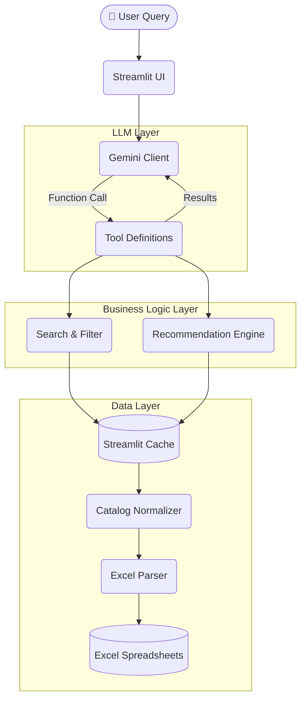

# 💻 GenAI Hardware Price Assistant


A production-ready Retrieval-Augmented Generation (RAG) style AI assistant designed to navigate, filter, and recommend PC hardware components. The agent seamlessly ingests unstructured tabular Excel data, normalizes it into a unified catalog, and uses Google's Gemini SDK with Tool Calling to answer complex user queries.

---

## 🏗️ Architecture

Theoretically, this project operates as an intelligent middle-tier router sitting between the user and raw unstructured data. When a user queries the Streamlit UI, the `HybridClient` intercepts the query and routes it to the primary LLM (Google Gemini). The LLM processes the natural language, determines the user's intent, and emits a structured function call rather than text. These function calls execute deterministic Python business logic (like fuzzy searching or filtering the parsed Excel catalog). The results are injected back into the LLM's context window, allowing it to synthesize a final, accurate answer. Crucially, if the primary Gemini API hits rate limits, the `HybridClient` instantly translates the conversational history and falls back to a secondary LLM (Groq's `llama-3.3-70b-versatile`), ensuring zero downtime and a completely seamless user experience.



## ✨ Key Features

1. **Intelligent Function Calling**: Gemini autonomously routes queries to exact lookups, fuzzy searches, filters, or recommendation pipelines.
2. **Robust Excel Parsing**: Automatically handles merged cells, jagged columns, inconsistent currency formatting (`$`, `₹`, `Rs`), and blank rows.
3. **Fuzzy Search & Scoring**: Uses `RapidFuzz` to calculate confidence thresholds (exact match vs. likely match vs. clarification suggestions) to prevent hallucinated prices.
4. **Conversational Memory**: The system remembers your previous filters and tool outputs natively using `st.session_state` and Gemini's persistent chat objects.
5. **Security Hardened**: 
   - Strict query truncation.
   - Comprehensive prompt-injection defense.
   - Internal stack traces completely hidden from LLM and User.
   - Full event auditing via `audit.log`.

---

## 🚀 Installation & Setup (Windows)

**1. Clone the repository and navigate to the project root:**
```cmd
cd path\to\hardware-price-assistant
```

**2. Create and activate a Virtual Environment:**
```cmd
python -m venv venv
venv\Scripts\activate
```

**3. Install Dependencies:**
```cmd
pip install -r requirements.txt
```

**4. Environment Variables:**
Rename `.env.example` to `.env` and insert your API key.
```cmd
copy .env.example .env
```
Ensure your `.env` contains:
```
GEMINI_API_KEY=your_real_api_key_here
```

---

## 🎮 Usage

Start the Streamlit application:
```cmd
streamlit run main.py
```

### Example Queries
Try asking the assistant:
- *"What is the cheapest AM5 motherboard?"*
- *"Compare the Ryzen 9 9950X and the Ryzen 5 9600X."*
- *"What motherboards do you recommend for a 9800X3D?"*
- *"Show me all MSI B850 boards."*

---

## 🧪 Testing

The project uses `pytest` with `pytest-mock` for robust unit testing across data parsing, LLM simulation, error handling, and UI interactions.

Run the test suite:
```cmd
pytest tests/
```

---

## 🛠️ Troubleshooting

- **`API key not valid` error**: Double-check that your `GEMINI_API_KEY` in `.env` is correct and active.
- **`Catalog is empty`**: Ensure your Excel file is located in the `data/` directory and matches the expected format.
- **Missing Module Errors**: Verify your virtual environment is activated (`venv\Scripts\activate`) before running `streamlit run main.py`.
